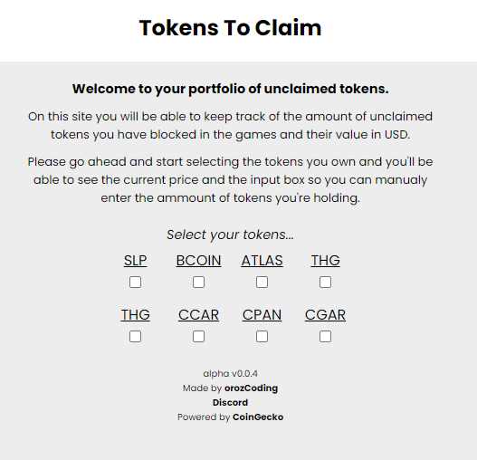
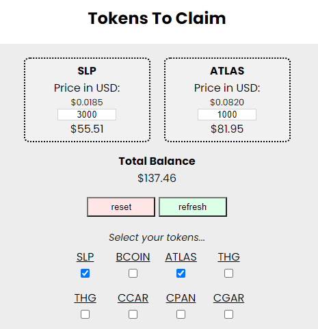

# Tokens To Claim

It is a personal project I wanted to build in order to practice my most recent knowledge in HTML, CSS and JavaScript.

On this site you will be able to keep track of the amount of unclaimed tokens you have blocked in the games and their value in USD.

## Preview

## Live Demo

## Built With

- HTML, CSS and JavaScript

## Authors

👤 **Angel Orozco (orozCoding)**

- GitHub: [@githubhandle](https://github.com/orozCoding)
- LinkedIn: [LinkedIn](https://www.linkedin.com/in/angel-orozco-652230228/)

## 🤝 Contributing

Contributions, issues, and feature requests are welcome!

Feel free to check the [issues page](../../issues/).

## Show your support

Give a ⭐️ if you like this project!

## 📝 License

This project is [MIT](./MIT.md) licensed.
